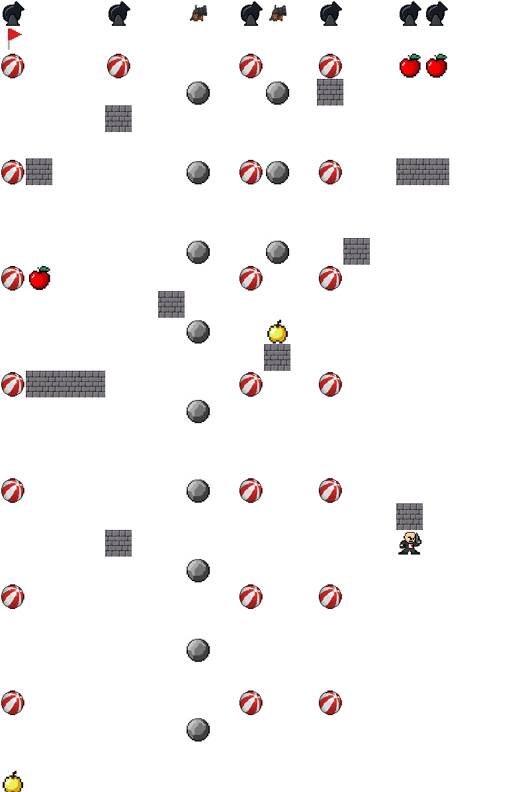

# Capture-the-flag-RL

Capture the Flag Agent (Q-learning-based)
## Project Overview
This project is focused on the development of a reinforcement learning agent for navigating an obstacle-filled grid and capturing a flag. The agent uses Q-learning to learn how to efficiently navigate the grid and achieve its goal, both with tabular Q-learning and neural network-based Q-learning approaches.
The project is built using Python, Pygame, NumPy, and PyTorch for the agent’s development and training. Additionally, curriculum learning is implemented to improve the training process and ensure the agent learns progressively and efficiently.

This project is still in progress, with ongoing improvements and optimizations.

## Key Features
Features
- Obstacle-filled grid: The agent learns to navigate grids with obstacles. Obstacles include: cannonballs and walls. There are also some additional rewards: golden and normal apples.
- Q-learning-based agent: Both tabular Q-learning and neural network-based Q-learning are implemented for training.
- Curriculum learning: The agent starts with simpler tasks and gradually moves to more complex environments, improving the learning process.
- Pygame integration: Real-time simulation and visualization of the agent's progress.

## Technologies used
- Pygame,
- NumPy,
- PyTorch.
  
